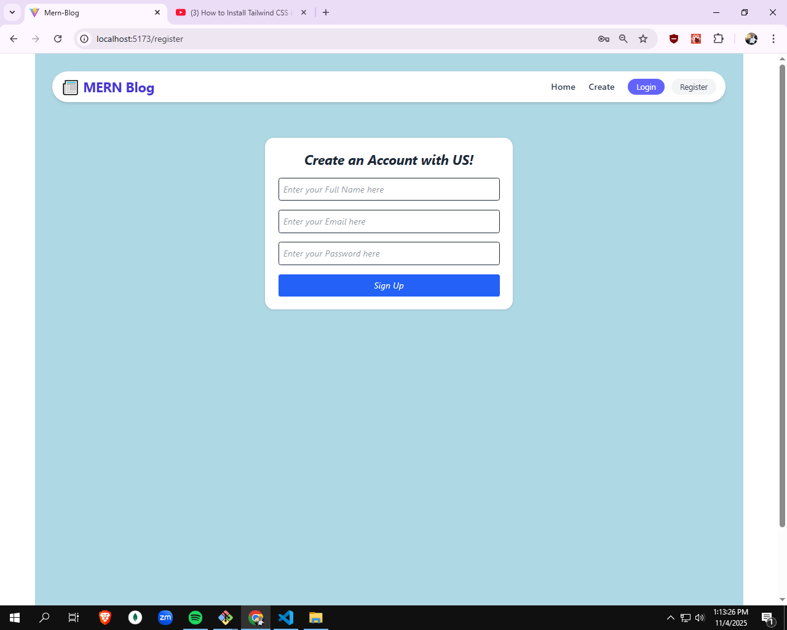
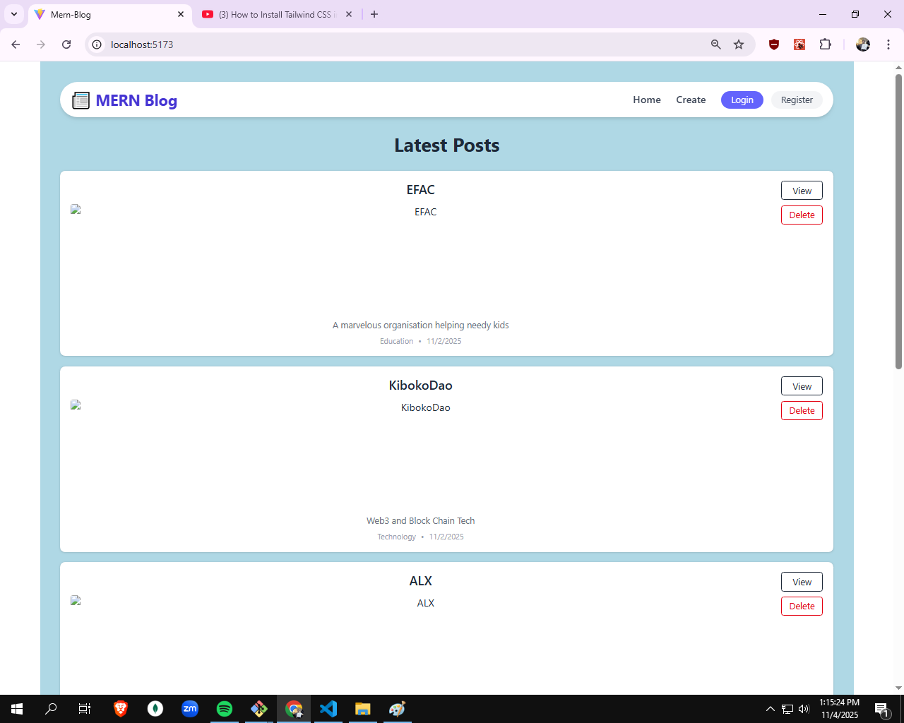
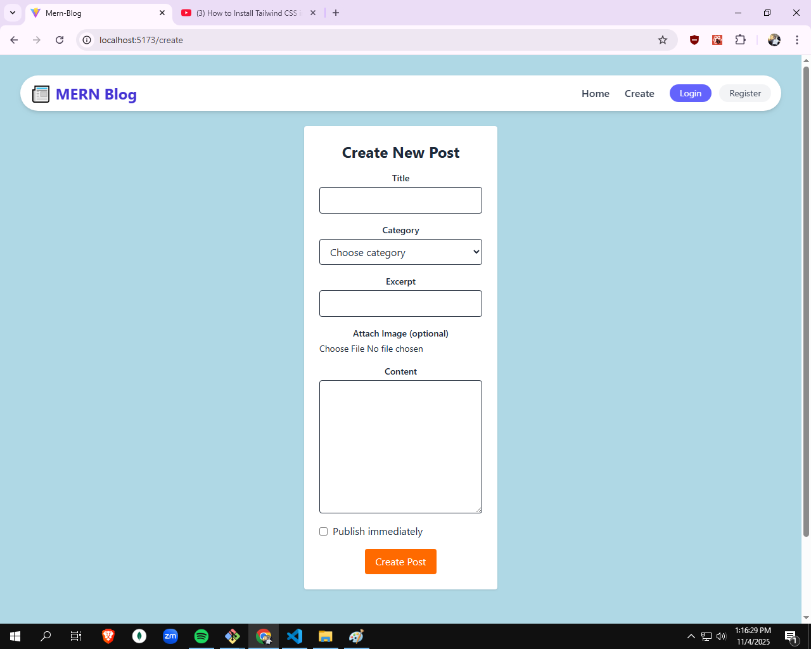

# MERN Blog Application

A full-stack blog application built using the MERN (MongoDB, Express.js, React.js, Node.js) stack.

## Features

- User authentication (Register/Login)
- Create, Read, Update, and Delete blog posts
- Responsive design for all devices
- Rich text editor for blog content
- User profile management
- Comment system

## Demo Screenshots


*Login interface for users*


*Main blog listing page*


*Create new blog post interface*

## Technologies Used

- MongoDB - Database
- Express.js - Backend framework
- React.js - Frontend framework
- Node.js - Runtime environment
- JWT - Authentication
- Bootstrap - Styling

## Installation

1. Clone the repository
```bash
git clone https://github.com/yourusername/mern-blog.git
```

2. Install dependencies for backend and frontend
```bash
# Install backend dependencies
cd backend
npm install

# Install frontend dependencies
cd frontend
npm install
```

3. Create a .env file in the backend directory and add:
```
MONGODB_URI=your_mongodb_connection_string
JWT_SECRET=your_jwt_secret
```

4. Run the application
```bash
# Run backend
cd backend
npm start

# Run frontend
cd frontend
npm start
```

## Contributing

Pull requests are welcome. For major changes, please open an issue first to discuss what you would like to change.

## License

[MIT](https://choosealicense.com/licenses/mit/)